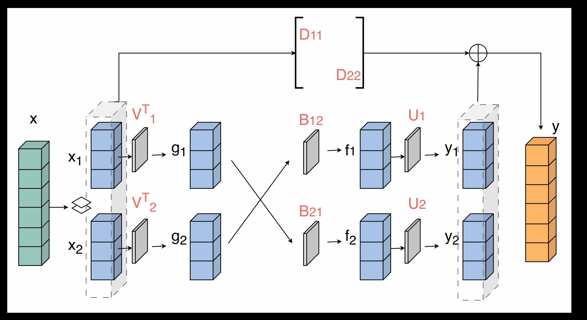
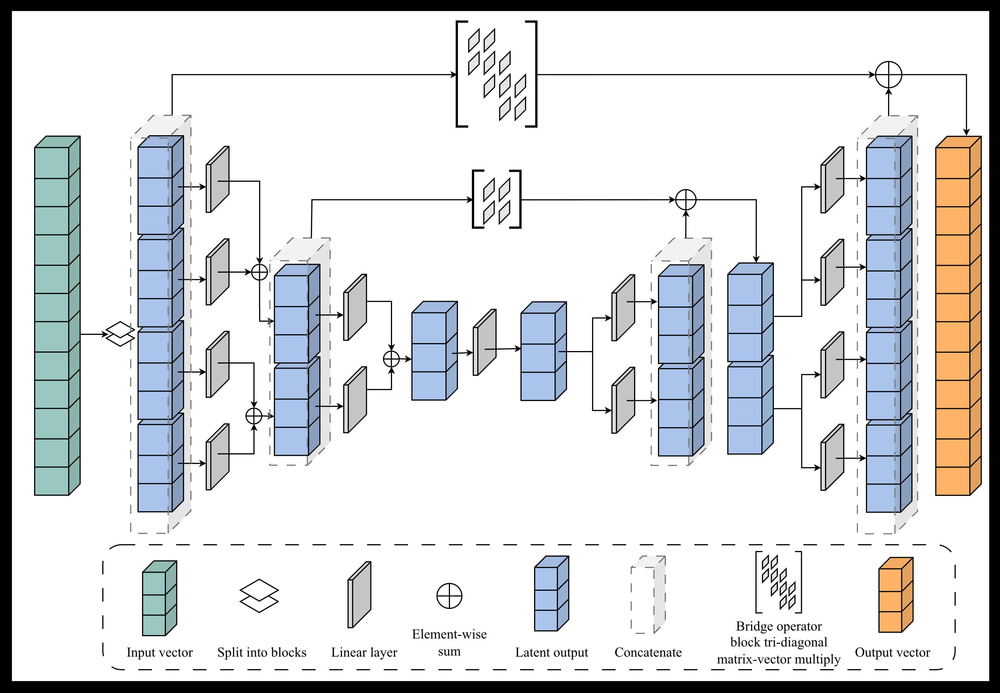

## Introduction

In our previous work[^1], we introduced the GFMM-block, which is a generalized parameterization of the Fast Multipole Method's (FMM) matrix-vector computational graph. We showed that gradient descent can be used to learn FMM-like representations of (inverses of) linear operators instead of relying on hand-crafted FMM construction algorithms. This is useful when the operator structures are complex and the construction of FMM is unknown for certain operators. Moreover, the parameterization is efficient in the number of required parameters compared to a fully dense representation of the operator.

In this post, I want to extend this idea further to explore the possibility of ***learning*** the factorizations of linear operators, specifically the LU factorization. Previous work[^2] tried to achieve this with gradient descent by representing L and U as dense linear layers and masking the upper and lower triangular parts of the learnable weight matrices, which is not an efficient parameterization. Inspired by the GFMM-block, we can actually represent L and U more compactly and thus save on memory as well as compute complexity. This could be useful for large $N \times N$ matrices, as the GFMM-block representation is only $O(N)$ in the number of parameters.

## FMM and the structured representation of matrices

The rest of the post is structured as follows: 
1. GFMM-block : I will describe the GFMM-block and how it can be also used to represent block-lower and block-upper triangular matrices.
1. Training to factorize: There are some tricks that I used to improve the training - transpose loss, block-wise training.
1. Examples: Numerical examples of LU factorization of 1D discrete Laplacian, 1D and 2D, convection diffusion, 1D and 2D biharmonic operators and dense but low-rank covariance matrix of RBF kernel.
1. Thoughts: I will discuss the limitations of the current approach and some thoughts about future work.

### FMM level-1
I want to take a moment here to introduce the FMM representation. Consider, for example, an exponential covariance matrix $A$ defined as $A_{i,j} = \rho^{|i-j|}$ where $0 < \rho < 1$. This matrix appears frequently in ML applications (Gaussian Processes with exponential kernels) and [Physics](https://en.wikipedia.org/wiki/Ornstein%E2%80%93Uhlenbeck_process) (William Lyons' PhD thesis[^3] contains more such rank-structured matrix examples). This is a fully dense matrix. But if we $2\times2$ block-partition it and observe the $\color{orange}\text{off-diagonal blocks}$, we notice that they are actually rank-1. See an $8 \times 8$ numerical example below.

$$
\left[
\begin{array}{c|c}
  \color{gray}
  \begin{matrix}
    1 & 0.5 & 0.25 & 0.12 \\
    0.5 & 1 & 0.5 & 0.25 \\
    0.25 & 0.5 & 1 & 0.5 \\
    0.12 & 0.25 & 0.5 & 1
  \end{matrix}
  & 
  \colorbox{#ff000033}{$
  \color{orange}
  \begin{matrix} 
    0.06 & 0.03 & 0.01 & 0.00 \\
    0.12 & 0.06 & 0.03 & 0.01 \\
    0.25 & 0.12 & 0.06 & 0.03 \\
    0.50 & 0.25 & 0.12 & 0.06 
  \end{matrix} 
  $} 
  \\
  \hline
  \color{orange}
  \begin{matrix}
    0.06 & 0.12 & 0.25 & 0.50 \\
    0.03 & 0.06 & 0.12 & 0.25 \\
    0.01 & 0.03 & 0.06 & 0.12 \\
    0.00 & 0.01 & 0.03 & 0.06
  \end{matrix}
  &
  \color{gray}
  \begin{matrix}
    1 & 0.5 & 0.25 & 0.12 \\
    0.5 & 1 & 0.5 & 0.25 \\
    0.25 & 0.5 & 1 & 0.5 \\
    0.12 & 0.25 & 0.5 & 1
  \end{matrix}
\end{array}
\right]
\begin{array}{l}
  \color{orange} \xrightarrow{\quad \text{SVD} \quad} 
  \underbrace{\begin{bmatrix} 0.125 \\ 0.25 \\ 0.5 \\ 1 \end{bmatrix}}_{U} \cdot 
  \underbrace{[0.5]}_{D} \cdot 
  \underbrace{\begin{bmatrix} 1 & 0.5 & 0.25 & 0.125 \end{bmatrix}}_{V^T}
  \\
  \phantom{
    \begin{matrix}
    1 & 0.5 & 0.25 & 0.12 \\
    0.5 & 1 & 0.5 & 0.25 \\
    0.25 & 0.5 & 1 & 0.5 \\
    0.12 & 0.25 & 0.5 & 1
    \end{matrix}
  }
\end{array}
$$
Thus we can compactly represent the above matrix as
$$
\left[
\begin{array}{c|c}
%\begin{matrix}
    D_{11} & U_{1} B_{12} V^{T}_{2} \\
\hline
    U_{2} B_{21} V^{T}_{1} & D_{22} \\
%  \end{matrix}
\end{array}
\right]
$$
Let us see how this affects the computation of matrix-vector product. Let $x$ be the vector we need to multiply and we conformally partition it as $[x_{1} \quad x_{2}]$ and we get the output $y$ as
$$
\begin{aligned}
g_{i} &= V^T_{i}x_{i} \\
f_{i} &= B_{ij} g_{j} \quad j \neq i\\
y_{i} &= U_{i} f_{i} + D_{ii}x_{i}
\end{aligned}
$$
where the intermediate multiplications are shown explicitly. This resembles a feed-forward computational graph as shown below.

This way, each multiplier is a smaller $P \times P$ sub-matrix ($V_{i}, U_{i}, B_{i,j}$) where $P ( \ll N)$ is the low-rank of the off-diagonal block. The full-rank diagonal blocks are only multiplied to the input sub-vectors and added back at the end of the computational graph. In this way, an FMM matrix-vector multiplication can be compactly represented as a feed-forward network and efficiently computed.

### FMM level-2
We can actually do even better than the above, by recursively partitioning the diagonal blocks like this:
$$
\left[
\begin{array}{c|c}
  \begin{array}{c|c}
    \color{gray} \begin{matrix} 1 & 0.5 \\ 0.5 & 1 \end{matrix} & 
    \color{teal}\begin{matrix} 0.25 & 0.125 \\ 0.5 & 0.25 \end{matrix} \\
    \hline
    \color{teal}\begin{matrix} 0.25 & 0.5 \\ 0.12 & 0.25 \end{matrix} & 
    \color{gray}\begin{matrix} 1 & 0.5 \\ 0.5 & 1 \end{matrix}
  \end{array}
  & 
 \color{orange}
  \begin{matrix} 
    0.06 & 0.03 & 0.01 & 0.00 \\
    0.12 & 0.06 & 0.03 & 0.01 \\
    0.25 & 0.12 & 0.06 & 0.03 \\
    0.50 & 0.25 & 0.12 & 0.06 
  \end{matrix} 
  \\
  \hline
 \color{orange}
  \begin{matrix}
    0.06 & 0.12 & 0.25 & 0.50 \\
    0.03 & 0.06 & 0.12 & 0.25 \\
    0.01 & 0.03 & 0.06 & 0.12 \\
    0.00 & 0.01 & 0.03 & 0.06
  \end{matrix}
  &
  \begin{array}{c|c}
    \color{gray} \begin{matrix} 1 & 0.5 \\ 0.5 & 1 \end{matrix} & 
    \color{teal}\begin{matrix} 0.25 & 0.125 \\ 0.5 & 0.25 \end{matrix} \\
    \hline
    \color{teal}\begin{matrix} 0.25 & 0.5 \\ 0.12 & 0.25 \end{matrix} & 
    \color{gray}\begin{matrix} 1 & 0.5 \\ 0.5 & 1 \end{matrix}
  \end{array}
\end{array}
\right]

\rightarrow
\left[
\begin{array}{c|c}
  \begin{array}{c|c}
    \color{gray} D^2_{11} & 
    \color{teal} U^2_{1} B^2_{12} V^{2^T}_{2} \\
    \hline
    \color{teal} U^2_{2} B^2_{21} V^{2^T}_{1} & 
    \color{gray} D^2_{22}
  \end{array}
  & 
 \color{orange}
  U^1_{1} B^1_{12} V^{1^T}_{2} 
  \\
  \hline
 \color{orange}
  U^1_{2} B^1_{21} V^{1^T}_{1}
  &
  \begin{array}{c|c}
    \color{gray} D^2_{33} & 
    \color{teal} U^2_{3} B^2_{34} V^{2^T}_{4} \\
    \hline
    \color{teal} U^2_{4} B^2_{43} V^{2^T}_{3} & 
    \color{gray} D^2_{44}
  \end{array}
\end{array}
\right]
$$
and obtaining the low-rank representations of the level-2 off-diagonal blocks (super-scripts denote the level). 

Moreover, the level-1 orthogonal matrices $U^1_{i}, V^1_{i}$ can actually be decomposed using the level-2 $U^2_{i}, V^2_{i}$ matrices like this:

$$
\begin{array}{cc}
% 1. LHS: The "Big" Tall Matrix U_1;1
\left[
\begin{array}{ccccc}
  & & \phantom{\vdots} & &  \\
  & & \phantom{\vdots} & &  \\
  & & \color{orange}\mathbf{U}^1_{1} & &  \\
  & & \phantom{\vdots} & &  \\
  \phantom{\vdots} 
\end{array}
\right]
% Equals Sign
\boldsymbol{=}
% 2. RHS: The Block Matrix
\begin{array}{cc}
  % -- TOP ROW --
  % U_2;1 (Tall) \\
\left[
  \begin{matrix} 
    \phantom{\vdots} \\ 
    \color{teal}\mathbf{U}^2_{1} \\ 
    \phantom{\vdots} 
  \end{matrix} \\
\right] 
  & 
  % R_2;1 (Wide) - \hspace pushes the width out \\ \\
\left[ 
   \hspace{1em} \mathbf{R}^2_{1} \hspace{1em}  \\
\right] 
  \\[1em] % Extra vertical gap between the top and bottom blocks

  % -- BOTTOM ROW --
  % U_2;2 (Tall)
  \left[
  \begin{matrix} 
    \phantom{\vdots} \\ 
    \color{teal}\mathbf{U}^2_{2} \\ 
    \phantom{\vdots} 
  \end{matrix} \\
\right] 
  & 
  % R_2;1 (Wide) - \hspace pushes the width out \\ \\
\left[ 
   \hspace{1em} \mathbf{R}^2_{2} \hspace{1em}  \\
\right] 
\end{array}
\quad 
;
& %%%% V
\quad
\left[
\begin{array}{ccccc}
  & & \phantom{\vdots} & &  \\
  & & \phantom{\vdots} & &  \\
  & & \color{orange}\mathbf{V}^1_{1} & &  \\
  & & \phantom{\vdots} & &  \\
  \phantom{\vdots} 
\end{array}
\right]
% Equals Sign
\boldsymbol{=}
% 2. RHS: The Block Matrix
\begin{array}{cc}
  % -- TOP ROW --
  % U_2;1 (Tall) \\
\left[
  \begin{matrix} 
    \phantom{\vdots} \\ 
    \color{teal}\mathbf{V}^2_{1} \\ 
    \phantom{\vdots} 
  \end{matrix} \\
\right] 
  & 
  % R_2;1 (Wide) - \hspace pushes the width out \\ \\
\left[ 
   \hspace{1em} \mathbf{W}^2_{1} \hspace{1em}  \\
\right] 
  \\[1em] % Extra vertical gap between the top and bottom blocks

  % -- BOTTOM ROW --
  % U_2;2 (Tall)
  \left[
  \begin{matrix} 
    \phantom{\vdots} \\ 
    \color{teal}\mathbf{V}^2_{2} \\ 
    \phantom{\vdots} 
  \end{matrix} \\
\right] 
  & 
  % R_2;1 (Wide) - \hspace pushes the width out \\ \\
\left[ 
   \hspace{1em} \mathbf{W}^2_{2} \hspace{1em}  \\
\right] 
\end{array}

\end{array}
$$
So we actually do not need to store the larger $U^1_{i}, V^1_{i}$ and only need to store smaller $U^2_{i}, V^2_{i}, R^2_{i}, W^2_{i}$, thus further reducing the memory complexity.

The matrix-vector multiplication now becomes:
$$
\begin{aligned}
  % GROUP 1: Up-Sweep
  \left.
  \begin{aligned}
    g^k_{i} &= V^{k^T}_{i} x_{i} \\
    g^{k-1}_{i} &= W^{k^T}_{2i-1} g^{k}_{2i-1} + W^{k^T}_{2i} g^{k}_{2i}
  \end{aligned}
  \right\} \quad & \text{up-sweep recursions} \\[1em]
  %
  % GROUP 2: Down-Sweep
  \left.
  \begin{aligned}
    f^k_{2i-1} &= B^k_{2i-1,2i}g^k_{2i} + R^k_{2i-1}f^{k-1}_{i} \\
    f^k_{2i} &= B^k_{2i,2i-1}g^k_{2i-1} + R^k_{2i}f^{k-1}_{i}
  \end{aligned}
  \right\} \quad & \text{down-sweep recursions} \\[1em]
  %
  % GROUP 3: Output
  \begin{aligned}
    y_{i} &= U^k_{i}f^k_{i} + D^k_{ii}x_{i}
  \end{aligned} \quad & \text{output}
\end{aligned}
$$
and the corresponding feed-forward network is expressed as

The up-sweep and down-sweep recursions have a *binary-tree* structure and resemble an encoder and decoder of a U-Net style architecture. The bridge connections should be block-diagonal for the given example, but as shown in the figure above, they can be made more generalized to accommodate more complicated rank structures in the FMM representation (figure shows block tri-diagonal, they can also be made lower/upper diagonal, penta-diagonal, Toeplitz, Circulant etc, depending on the structure of the underlying linear operator).

To summarize everything so far, we looked at how dense, rank-structured matrices can be represented using FMM and how the dense matrix-vector multiply, that requires $O(N^2)$ operations, can be implemented in $O(P^2N); P\ll N$, using FMM computational graph that also looks like a feed-forward (U-Net-like) network. We call the above network which is a generalized FMM skeleton as *GFMM-block*.

---
### L and U using FMM

As already noted above, we can use the GFMM-block to represent different structured matrices. To see how we can obtain a block-triangular matrix from GFMM-block, notice in the architecture that the output block-wise components $y_{i}$ depend on $x_{j}; j \neq i$ directly through the outer-most bridge connection. Specifically, if the bridge is purely block-diagonal, then $y_{i}$ only depends on $x_{i}$. If it is block-tri-diagonal, then $y_{i}$ only depends on $x_{j}$ for $j=\{i-1, i, i+1\}$. So in order to make the operator block-triangular, it only suffices to make the bridge connections also block-triangular. There is just one catch, for the interior bridge connections from $g_{i}$ to $f_{i}$, each $f_{i}$ also depends on $g_{j}$ for $j=\{2i-1, 2i\}$ through the diagonal blocks. This pathway leaks signal from $i$ to both $2i-1$ and $2i$ resulting in each block of output depending on every other block of input. So to get a block-triangular structure, we need to make the interior bridge connections strictly upper or strictly lower-triangular. To see this concretely, consider a worked out example below (notice the lower-**bi**-diagonal outer-most bridge, but strictly lower-diagonal inner bridges):

This computes the matrix-vector multiplication of a block-lower-triangular matrix $L$, from which we can deduce it's representation in the form of network's parameters as:
$$
L = 
\begin{bmatrix}
  \color{skyblue} D_{11}^2 & 0 & 0 & 0 \\[1em]
  \color{skyblue} D_{21}^2 & \color{skyblue} D_{22}^2 & 0 & 0 \\[1em]
  \color{orangered} R_3^2 \color{skyblue} B_{21}^1 \color{orangered} W_1^2 & 
  \color{skyblue} D_{32}^2 + \color{orangered} R_3^2 \color{skyblue} B_{21}^1 \color{orangered} W_2^2 & 
  \color{skyblue} D_{33}^2 & 0 \\[1em]
  \color{orangered} R_4^2 \color{skyblue} B_{21}^1 \color{orangered} W_1^2 & 
  \color{orangered} R_4^2 \color{skyblue} B_{21}^1 \color{orangered} W_2^2 & 
  \color{skyblue} D_{43}^2 & \color{skyblue} D_{44}^2
\end{bmatrix}
$$

Similarly, by making the interior bridge connections to be strictly block-upper-diagonal and outer bridge to be block-upper-bi-diagonal, we can construct a block-upper-triangular matrix $U$.
$$
U = 
\begin{bmatrix}
  \color{skyblue} P_{11}^2 & \color{skyblue} P_{12}^2 & \color{orangered} S_1^2 \color{skyblue} Q_{12}^1 \color{orangered} Z_3^2 & \color{orangered} S_1^2 \color{skyblue} Q_{12}^1 \color{orangered} Z_{4}^2 \\[1em]
  0 & \color{skyblue} P_{22}^2 & \color{skyblue} P_{23}^2 + \color{orangered} S_2^2 \color{skyblue} Q_{12}^1 \color{orangered} Z_3^2 & \color{orangered} S_2^2 \color{skyblue} Q_{12}^1 \color{orangered} Z_4^2 \\[1em]
  0 & 
  0 & 
  \color{skyblue} P_{33}^2 & \color{skyblue} P_{34}^2 \\[1em]
  0 & 
  0 & 
  0 & \color{skyblue} P_{44}^2
\end{bmatrix}
$$
---
## Learning LU

Given that we can represent a block-lower-triangular and block-upper-triangular matrices in the form of a feed-forward network, that can compute their corresponding matrix-vector products, we now ask the question that we are actually interested in: can we *learn* the LU factorization of any dense matrix?

In our MNO paper [^1], we showed that the FMM representations of inverse of 1D and 2D discrete Laplacians can be learnt by randomly initializing the parameters of GFMM-block and training using the synthetic data $(b, x)$ where $b = Ax$ and $A$ is the Laplacian operator. We used a simple MSE loss function $\| \hat{{x}}-x \|_{2}^2$ where $\hat{x}$ is the network's predicted output for a given input $b$. In this way, we do not need to actually compute $A^{-1}$ to train the network.

Similarly, our goal in learning the LU factorization of a matrix $A$ is so that we can use the learnt network to solve $Ax=b$ without actually computing $A^{-1}$ (even during training). Then how do we actually train this LU-network? We can see that by stacking the U and L GFMM-blocks sequentially ( $x \rightarrow U \rightarrow L \rightarrow b$ ), we are actually computing $LUx =Ax = b$. So we use the similar procedure as before to train this joint LU network like this:

1. Randomly initialize the parameters in L and U GFMM-block networks.
2. For the input $e_{i}$ ($i$'th column of Identity matrix), $LUe_{i}$ should produce the $i$'th column of $A$. Thus the pairs $(e_{i}, A_{i})$ form our input-groundtruth pairs.
3. Use MSE loss function $\| \sum_{i} \hat{A_{i}}-A_{i} \|_{2}^2$ and backpropagate using SGD, where $\hat{A} = L(U(e_{i}))$.

Once the network is trained, if needed, L and U can be computed separately by generating columns $[L(e_{i})], [U(e_{i})] \quad \forall i$. But of course, the network representations are compact.

### Limitations
1. The main limitation of this proposed approach is the lack of pivoting, because the networks are static in their representations. This might constrain the domain of learnable matrices to only positive definite matrices. In which case, the advantage of this learnable method over classical gaussian elimination would only be that of memory efficiency.
2. Another major limitation is numerical accuracy. Because the networks are composed as sequence of matrix-matrix multiplications, the floating point errors accumulate rapidly.

Because of these limitations, this method might be more suitable for computing approximate LU and to be used as [preconditioners](https://en.wikipedia.org/wiki/Preconditioner) for iterative solvers.

### Some training tricks

We found that using a couple of other tricks, training of LU network could be improved:
#### Transpose loss

Firstly, note that $A^Tx$ could also be computed using the same GFMM-block that is representing a given matrix $A$ by simple changes in the computational graph and transposing each of $D_{ij}, B_{ij}, U_{i}, V_{i}, W_{i}, R_{i}$ weight matrices. We noticed that adding $U^T(L^T(e_{i})) = \hat{A^T_{i}}$ also into the loss function helped in faster convergence of training. To do this, we perform the forward pass twice, once without transpose and once with transpose for a given $e_{i}$ and compute the total MSE loss w.r.t $A_{i}$ and $A^T_{i}$. This also improved the error patterns in the final approximation. See the numerical example in [DiscreteLaplacian](#DiscreteLaplacian) below.

#### Block-wise training

We noticed that when training the entire network end-to-end, large errors are appearing at the top left diagonal blocks of $A$ (see the [DiscreteLaplacian](#DiscreteLaplacian) for an example). To understand why that could be the case, take a look at the expanded form of the parameterized LU from the previous example:

$$
LU = 
\tiny
\begin{bmatrix}
  % --- ROW 1 ---
  \color{skyblue} D_{11}^2 P_{11}^2 & 
  \color{skyblue} D_{11}^2 P_{12}^2 & 
  \color{skyblue} D_{11}^2 \color{orangered} S_1^2 \color{skyblue} Q_{12}^1 \color{orangered} Z_3^2 & 
  \color{skyblue} D_{11}^2 \color{orangered} S_1^2 \color{skyblue} Q_{12}^1 \color{orangered} Z_4^2 \\[2em]

  % --- ROW 2 ---
  \color{skyblue} D_{21}^2 P_{11}^2 & 
  \color{skyblue} D_{21}^2 P_{12}^2 + D_{22}^2 P_{22}^2 & 
  \color{skyblue} D_{22}^2 P_{23}^2 + (\color{skyblue} D_{21}^2 \color{orangered} S_1^2 + \color{skyblue} D_{22}^2 \color{orangered} S_2^2) \color{skyblue} Q_{12}^1 \color{orangered} Z_3^2 & 
  (\color{skyblue} D_{21}^2 \color{orangered} S_1^2 + \color{skyblue} D_{22}^2 \color{orangered} S_2^2) \color{skyblue} Q_{12}^1 \color{orangered} Z_4^2 \\[2em]

  % --- ROW 3 ---
  \color{orangered} R_3^2 \color{skyblue} B_{21}^1 \color{orangered} W_1^2 \color{skyblue} P_{11}^2 & 
  \color{skyblue} D_{32}^2 P_{22}^2 + \color{orangered} R_3^2 \color{skyblue} B_{21}^1 (\color{orangered} W_1^2 \color{skyblue} P_{12}^2 + \color{orangered} W_2^2 \color{skyblue} P_{22}^2) & 
  \begin{aligned}
    & \color{skyblue} D_{33}^2 P_{33}^2 + (\color{skyblue} D_{32}^2 + \color{orangered} R_3^2 \color{skyblue} B_{21}^1 \color{orangered} W_2^2) \color{skyblue} P_{23}^2 \\
    & + [\color{skyblue} D_{32}^2 \color{orangered} S_2^2 + \color{orangered} R_3^2 \color{skyblue} B_{21}^1 (\color{orangered} W_1^2 S_1^2 + W_2^2 S_2^2)] \color{skyblue} Q_{12}^1 \color{orangered} Z_3^2
  \end{aligned} & 
  \begin{aligned}
    & \color{skyblue} D_{33}^2 P_{34}^2 \\
    & + [\color{skyblue} D_{32}^2 \color{orangered} S_2^2 + \color{orangered} R_3^2 \color{skyblue} B_{21}^1 (\color{orangered} W_1^2 S_1^2 + W_2^2 S_2^2)] \color{skyblue} Q_{12}^1 \color{orangered} Z_4^2
  \end{aligned} \\[4em]

  % --- ROW 4 ---
  \color{orangered} R_4^2 \color{skyblue} B_{21}^1 \color{orangered} W_1^2 \color{skyblue} P_{11}^2 & 
  \color{orangered} R_4^2 \color{skyblue} B_{21}^1 (\color{orangered} W_1^2 \color{skyblue} P_{12}^2 + \color{orangered} W_2^2 \color{skyblue} P_{22}^2) & 
  \begin{aligned}
    & \color{skyblue} D_{43}^2 P_{33}^2 + \color{orangered} R_4^2 \color{skyblue} B_{21}^1 \color{orangered} W_2^2 \color{skyblue} P_{23}^2 \\
    & + \color{orangered} R_4^2 \color{skyblue} B_{21}^1 (\color{orangered} W_1^2 S_1^2 + W_2^2 S_2^2) \color{skyblue} Q_{12}^1 \color{orangered} Z_3^2
  \end{aligned} & 
  \begin{aligned}
    & \color{skyblue} D_{44}^2 P_{44}^2 + \color{skyblue} D_{43}^2 P_{34}^2 \\
    & + \color{orangered} R_4^2 \color{skyblue} B_{21}^1 (\color{orangered} W_1^2 S_1^2 + W_2^2 S_2^2) \color{skyblue} Q_{12}^1 \color{orangered} Z_4^2
  \end{aligned}
\end{bmatrix}
$$

We can see that the lower (and rightside) blocks have more number of parameters contributing to the values at those positions. So, the network has more freedom to optimize and reduce the error for those blocks, whereas top-left blocks are more constrained by fewer parameters. Is there a way to fix this without trading-off the smaller errors in bottom right blocks? We found that there is actually a way. To see how, first observe that the parameters have a dependency pattern from top left to bottom right. That is, NO parameter at the $(i,j)$ location of the combined $LU$ matrix depends on the parameters at $(<i, <j)$ locations. 

So, we can do sequential optimization, starting by only updating the parameters appearing in the first row by only computing MSE loss of $\hat{A_{i}}[0:P]$ i.e. first block row of $A$. Once the error of this first block row converges to a sufficiently smaller value, we can freeze these parameters and only backpropagate using the MSE loss of $\hat{A_{i}}[P:2P]$ (i.e. second block row of $A$) and continue until the last block row. We observed that this resolved the issue of larger errors at the top-left locations without compromising on the smaller errors at bottom-right locations.

This way, at each block row position, only the necessary parameters are updated and a more fine-grained control over the errors of different locations of $A$ is also obtained. It seems to me that this can also be leveraged to do pivoting during training, but I have not yet explored it. 
## Experiments

### Evaluation

We can use the following three metrics to evaluate the accuracy of the learnt LU network.

1. Operator approximation error $\|E_{A}\|_{p}$:
   $$
   \|E_{A}\|_{p} = \|\hat{A}-A\|_{p} = \|\hat{L} \hat{U}-A\|_{p}
   $$
   where $\hat{L}$ and $\hat{U}$ are the block-lower and block-upper triangular matrices, represented by the $L$ and $U$ GFMM-blocks respectively, and generated by simply inputting the Identity matrix as input to each GFMM-block.
   
   This metric measures how good the block-LU factored approximation is in approximating the original matrix. We also visually look at the error matrix $E_{A} = |\hat{A}-A|$, to check which areas of the matrix are approximated better/worse.
1. True solution error $e_{x}$
   For a given linear equation $Ax = b$, we want to look at how good the LU approximation is in solving for $x$, which is the usual goal of any linear solver. So, we can compute the predicted solution $\hat{x}$, obtained by forward and back-substitution from the generated L, U matrices and compare with the ground-truth $x$.
   
   $$
   e_{x, \text{LU-net}} = \| \hat{U}^{-1}\hat{L}^{-1}(Ax) - x \|
   $$
   We can also compare this inverse approximation error, with that of using the standard LU solver in LAPACK: $e_{x, \text{solver}}$.
2. Backward error $e_{b}$
   In realistic cases we do not have access to ground-truth $x$ of course. So we can only do as much as measuring the backward error given by
   
   $$
   e_{b} = \frac{\|A \hat{x}-b\|}{\|A\| \|\hat{x}\| + \| b\|}
   $$
   Again, we can measure the backward error for both the learnt LU network $e_{b, \text{LU-net}}$ and the baseline LAPACK solver $e_{b, \text{solver}}$.

Now let us see some numerical examples. 
### DiscreteLaplacian

First let us take the simplest case of 1D discrete Laplacian kernel matrix to approximate. For all the 1D experiments, I use 256x256 grid size with block size=32 in the GFMM-blocks.

Following graph shows training losses of LU network with three different configurations:
without transpose loss, without using block-wise training and finally using both transpose loss and block-wise training, as described earlier. We see that using transpose loss, training converges faster.

Following are the evaluation metrics for the three networks. For $e_{x}$ and $e_{b}$, in all experiments, the errors are averaged over 1000 samples where $x$ was drawn from a random normal distribution.

|                                      | $\|E_{A} \|_{2}$ | $e_{x, \text{solver}}$ | $e_{x, \text{LU-net}}$ | $e_{b, \text{solver}}$ | $e_{b, \text{LU-net}}$ |
| ------------------------------------ | ---------------- | ---------------------- | ---------------------- | ---------------------- | ---------------------- |
| Without transpose loss               | 2.0E-3           | 0.024                  | 0.370                  | 1.72E-8                | 3.59E-7                |
| Without block-wise training          | 6.6E-2           | 0.024                  | $\infty$               | 1.72E-8                | $\infty$               |
| Transpose-loss + block-wise training | 9.6E-3           | 0.024                  | 0.129                  | 1.72E-8                | 4.06E-7                |

Following is the absolute error of the approximated operator $E_{A} = |\hat{A}-A|$.
 

When trained without transpose loss, we can also see that the approximation is an asymmetric matrix whereas the actual Laplacian matrix is a symmetric matrix. Using transpose loss, not only does the training converges faster, but also the approximation obeys the symmetric structure of the underlying operator. This is because the updates to L and U networks are symmetric by adding the transpose loss:
$$
\text{total loss} = \|LU-A\| + \|U^TL^T-A^T\|
$$
as during backpropagation, both L and U weights appear symmetrically and at the same time in the computational graph.

When trained without block-wise training, we can see that large errors accumulate in the top-left parts of the matrix, as I described in the previous section. This actually leads to very large condition number of the approximated matrix and consequently, the errors blew up when solving $Ax=b$. But using the block-wise training, the errors are more or less evenly distributed across the diagonal.

Now let us see some more complicated operators.

### Convection-Diffusion Operator (Asymmetric PD)

$$-\epsilon \Delta u + \vec{\beta} \cdot \nabla u = f$$
using up-wind finite difference discretization to keep the operator positive definite, but the presence of both diffusion and convection terms introduces asymmetry.

#### 1D
| $\|E_{A} \|_{2}$ | $e_{x, \text{solver}}$ | $e_{x, \text{LU-net}}$ | $e_{b, \text{solver}}$ | $e_{b, \text{LU-net}}$ |
| ---------------- | ---------------------- | ---------------------- | ---------------------- | ---------------------- |
| 4.9E-3           | 0.345                  | 29380.7                | 1.84E-8                | 1.17E-5                |
Condition number of $A$ = 391199.
Condition number of $\hat{A}$ = 4236075520.
#### 2D
| $\|E_{A} \|_{2}$ | $e_{x, \text{solver}}$ | $e_{x, \text{LU-net}}$ | $e_{b, \text{solver}}$ | $e_{b, \text{LU-net}}$ |
| ---------------- | ---------------------- | ---------------------- | ---------------------- | ---------------------- |
| 1.6E-4           | 1.8E-4                 | 2.1E-3                 | 3.15E-8                | 6.19E-7                |

### Bi-harmonic operator

$$\Delta^2 u = f$$
4-th order system to really test the numerical instability. In 1D, this looks like a pentadiagonal matrix (row: `1, -4, 6, -4, 1`). The condition number grows as $O(N^4)$ rather than $O(N^2)$ like the Laplacian. Used in continuum mechanics to model the bending of thin plates or the stream function in Stokes flow. The ill-conditionness of the operator makes the entries in $L$ and $U$ to vary largely in magnitude and so challenges the dynamic range of the network's weights.

#### 1D

| $\|E_{A} \|_{2}$ | $e_{x, \text{solver}}$ | $e_{x, \text{LU-net}}$ | $e_{b, \text{solver}}$ | $e_{b, \text{LU-net}}$ |
| ---------------- | ---------------------- | ---------------------- | ---------------------- | ---------------------- |
| 9.5E-4           | 41.95                  | 1.02E+19               | 2.11E-8                | 4.95E-5                |
Condition no. of $A$: 44740336.
Condition no. of $\hat{A}$: 2534652160.

#### 2D
| $\|E_{A} \|_{2}$ | $e_{x, \text{solver}}$ | $e_{x, \text{LU-net}}$ | $e_{b, \text{solver}}$ | $e_{b, \text{LU-net}}$ |
| ---------------- | ---------------------- | ---------------------- | ---------------------- | ---------------------- |
| 0.078            | 0.022                  | 0.030                  | 3.39E-8                | 8.68E-7                |
### RBF Kernel (dense + low-rank)

$$A_{ij} = K(\|x_i - x_j\|) + \sigma^2 \delta_{ij}$$
Used in discretization of Fredholm integral equations or Covariance matrices from Gaussian Processes (e.g., using a Radial Basis Function or Matern kernel). The matrix is dense, but the off-diagonal blocks have low numerical rank. This tests if "Block LU" architecture can learn to approximate these low-rank blocks (effectively performing an [H-Matrix](https://en.wikipedia.org/wiki/Hierarchical_matrix) approximation). These matrices are Symmetric Positive Definite, so pivoting is strictly not required (Cholesky factorization is stable).

| $\|E_{A} \|_{2}$ | $e_{x, \text{solver}}$ | $e_{x, \text{LU-net}}$ | $e_{b, \text{solver}}$ | $e_{b, \text{LU-net}}$ |
| ---------------- | ---------------------- | ---------------------- | ---------------------- | ---------------------- |
| 0.243            | 13.12                  | $\infty$               | 2.29E-8                | 6.42E-7                |
Condition no. of $A$: 1201921.
Condition no. of $\hat{A}$: 5652878336.

We see that the network is able to produce decent approximations of even the complex operators, as shown by the absolute approximation error and backward errors. But if the underlying matrix is ill-conditioned, then the approximated LU is not good for solving $Ax = b$ like we initially anticipated given the absence of pivoting.
## Conclusion

Even though lack of pivoting makes the learning based LU approximation, using FMM blocks, numerically inferior to classical gaussian elimination based methods, these experiments provide good empirical evidence that structured factorizations could be learnt using gradient descent. For eg, learning QR factorization could solve the numerical issues with lack of pivoting in the training pipeline.

---

## References

[^1]: **MNO : A Multi-modal Neural Operator for Parametric Nonlinear BVPs. [Link to paper](https://arxiv.org/abs/2507.11870)

[^2]: **LU-Net: Invertible Neural Networks Based on Matrix Factorization. [Link to paper](https://arxiv.org/abs/2302.10524)

[^3]: **Fast Algorithms with Applications to PDEs. [Link to PhD thesis](https://scg.ece.ucsb.edu/publications/theses/Lyons_2005_Thesis.pdf)
